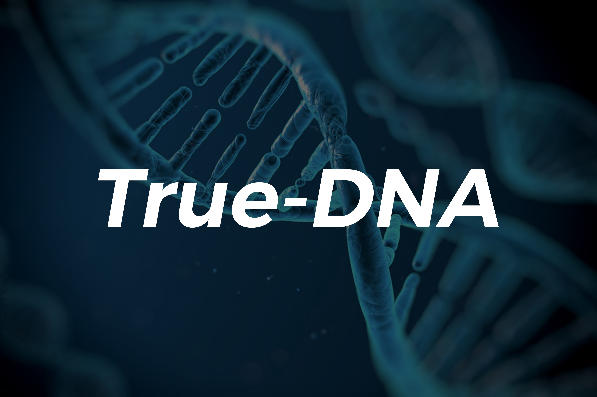
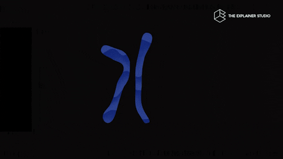

# TrueDNA

TrueDNA is a comprehensive and powerful computational biology project focused on DNA prediction and DNA replication. This GitHub repository serves as a central hub for the TrueDNA project, tools, and resources for researchers, computational biologists, and AI enthusiasts working in the field of artificial intelligence and genomics.

